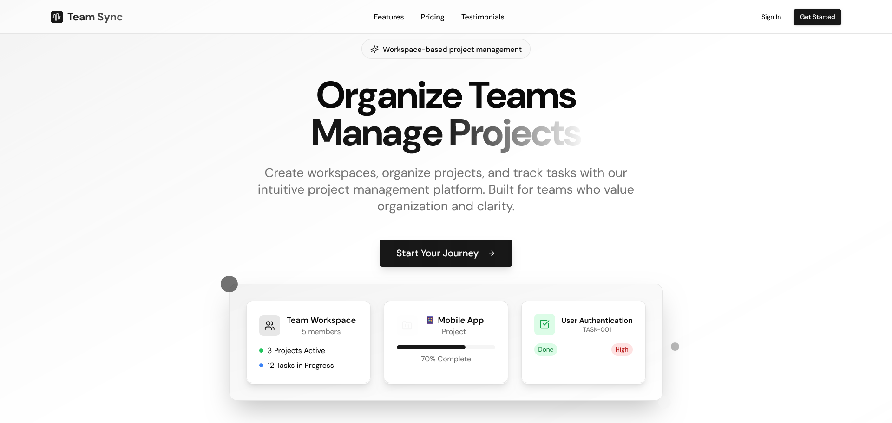
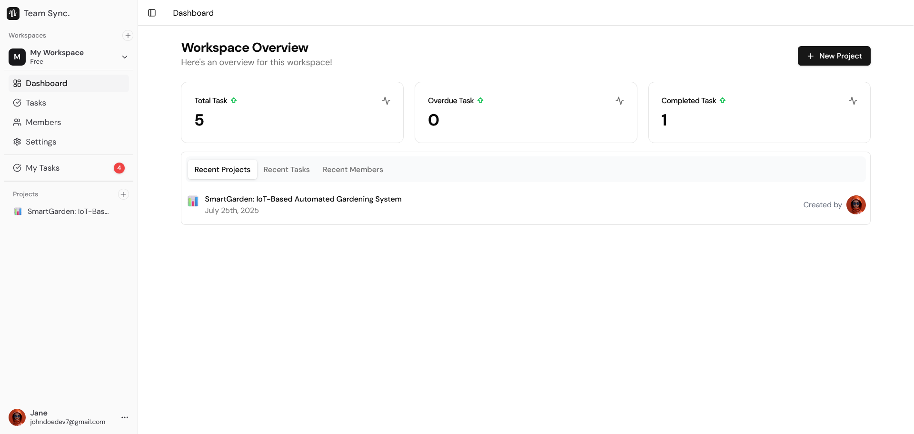
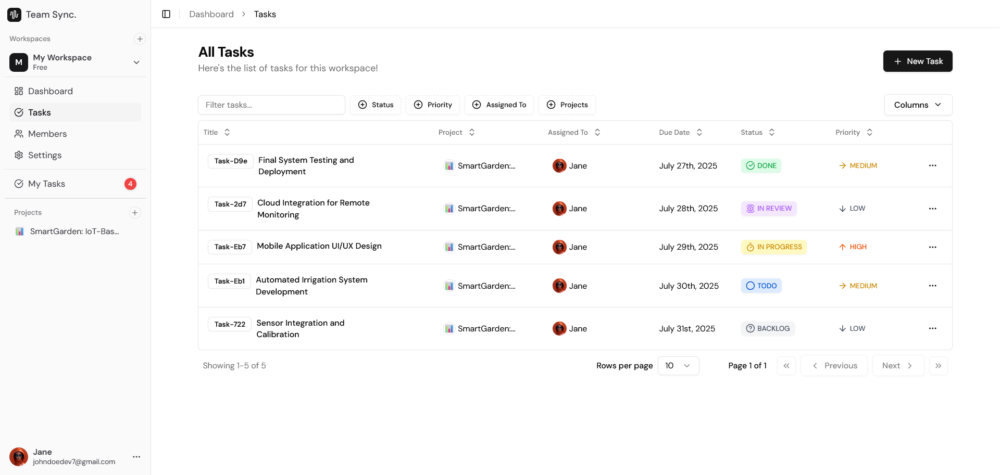
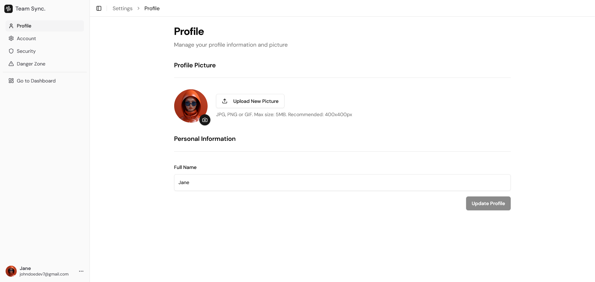

# Team Sync

A comprehensive, team collaboration and project management platform built with React 18, Node.js, and TypeScript. Features advanced workspace management, role-based access control, and intelligent task tracking with modern UI/UX design.

> **🎯 Project Background**: Originally inspired by [TechWithEmma's tutorial](https://www.youtube.com/watch?v=aoxHhSXDc8Y), this implementation has been completely transformed with extensive custom features, modern architecture, and other enhancements that showcase full-stack development expertise.

## 🚀 Live Demo

**[https://teamsync.singhaman.me](https://teamsync.singhaman.me)**


## � Key Enhancements Beyond Tutorial

**Custom Features Implemented:**

- **📊 Personal Task Dashboard ("My Tasks Page")** - Centralized view of user's tasks across all workspaces
- **👤 Comprehensive User Details Pages** - In-depth member profiles with activity tracking
- **🔍 Enhanced Project Details** - Rich project information with analytics and visual insights
- **🛡️ Advanced Role-Based Task Assignment** - Intelligent permission system for task delegation
- **⚙️ Complete Account Settings Suite** - Full user management with security, profile, and preferences
- **🎨 Professional Landing Page** - Marketing-focused homepage with feature showcases
- **🏢 No Workspace State Handling** - Graceful fallback when user's default workspace is deleted

**Technical Enhancements:**

- Complete JWT authentication overhaul (replaced Google OAuth)
- Email verification system with Resend integration
- Advanced state management with TanStack Query
- Modern deployment configuration
- Modern UI/UX with Tailwind CSS and Radix UI
- Comprehensive error handling and loading states

## ✨ Core Features

- **Multi-Workspace Management** - Create and manage multiple team environments
- **Advanced Authentication** - JWT-based auth with email verification and password reset
- **Intelligent Role System** - Owner, Admin, and Member roles with granular permissions
- **Project Organization** - Rich project management with emoji support and analytics
- **Real-Time Task Tracking** - Complete task lifecycle with comments and activity logs
- **Team Collaboration** - Member invitations, task transfers, and workspace settings
- **File Management** - Profile pictures and attachments via Cloudinary
- **Email Notifications** - Automated system emails with professional templates

## 🛠️ Technology Stack

**Frontend Architecture:**

- **React 18** with TypeScript for type-safe component development
- **Vite** for lightning-fast development and optimized builds
- **TanStack Query** for intelligent server state management
- **React Router DOM** with protected routes and navigation guards
- **React Hook Form** with Zod validation for robust form handling
- **Tailwind CSS + Radix UI** for consistent, accessible design system
- **Lucide Icons + Emoji Mart** for rich visual elements

**Backend Infrastructure:**

- **Node.js + Express** with TypeScript for scalable API development
- **MongoDB + Mongoose** for flexible document-based data storage
- **JWT Authentication** with secure cookie-based session management
- **Bcrypt** for industry-standard password hashing
- **Resend** for transactional email delivery
- **Cloudinary** for optimized image storage and processing
- **Zod** for runtime type validation and API security

**Production Deployment:**

- **Vercel** for frontend hosting with automatic deployments
- **Render** for backend hosting with MongoDB Atlas integration
- **Environment-based configuration** for seamless dev/prod transitions
- **CORS and security middleware** for cross-origin protection

## 📁 Project Structure

```
├── backend/          # Node.js Express API
│   ├── src/
│   │   ├── controllers/    # Route handlers
│   │   ├── models/         # MongoDB schemas
│   │   ├── services/       # Business logic
│   │   ├── routes/         # API endpoints
│   │   ├── middlewares/    # Auth & validation
│   │   └── utils/          # Helper functions
│   └── uploads/           # File storage
└── client/          # React frontend
    ├── src/
    │   ├── components/     # UI components
    │   ├── pages/          # Route pages
    │   ├── hooks/          # Custom React hooks
    │   ├── context/        # State management
    │   └── lib/            # API calls & utilities
    └── public/            # Static assets
```

## ⚡ Quick Start

### Prerequisites

- Node.js 18+
- MongoDB database
- Resend API key (emails)
- Cloudinary account (file uploads)

### Installation

1. **Clone and install dependencies**

   ```bash
   git clone https://github.com/thesinghaman/team-sync.git
   cd team-sync

   # Backend
   cd backend && npm install

   # Frontend
   cd ../client && npm install
   ```

2. **Environment Setup**

   ```bash
   # Backend .env
   NODE_ENV=development
   PORT=8000
   MONGO_URI=your_mongodb_connection
   JWT_SECRET=your_jwt_secret
   RESEND_API_KEY=your_resend_key
   CLOUDINARY_CLOUD_NAME=your_cloudinary_name
   CLOUDINARY_API_KEY=your_cloudinary_key
   CLOUDINARY_API_SECRET=your_cloudinary_secret
   FRONTEND_ORIGIN=http://localhost:5173

   # Client .env
   VITE_API_BASE_URL=http://localhost:8000/api
   ```

3. **Run Development Servers**

   ```bash
   # Backend (port 8000)
   cd backend && npm run dev

   # Frontend (port 5173)
   cd client && npm run dev
   ```

## 🏗️ Architecture & Implementation

**🔐 Authentication & Security**

- JWT-based authentication with secure HTTP-only cookies
- Email verification workflow with time-limited tokens
- Password reset system with cryptographic security
- Role-based middleware protection across all endpoints
- Input validation and sanitization with Zod schemas

**👥 Advanced Workspace Management**

- Intelligent task assignment rules based on member hierarchy
- Seamless member removal with task transfer capabilities
- Real-time workspace analytics and activity tracking
- Configurable permissions and granular access controls
- Multi-workspace user experience with context switching

**📋 Sophisticated Task System**

- Complete task lifecycle: Backlog → Todo → In Progress → In Review → Done
- Priority-based task organization with visual indicators
- Rich task commenting system with activity history
- Smart assignee management with role-based restrictions
- Cross-project task organization and filtering

**🎯 Modern Development Practices**

- Full TypeScript implementation for type safety across the stack
- Custom React hooks for reusable business logic
- Modular component architecture with clear separation of concerns
- Comprehensive error boundaries and graceful failure handling
- Performance optimized with lazy loading and code splitting

**Developer Experience**

- Comprehensive TypeScript integration with shared type definitions
- Hot module replacement and fast refresh for rapid development
- ESLint and Prettier configuration for consistent code quality
- Environment-based configuration for seamless deployment workflows

## 📱 Application Showcase

### User Onboarding Experience


_Clean onboarding flow with workspace creation and user guidance_

### Comprehensive Dashboard


_Multi-workspace dashboard with task overview and analytics_

### Advanced Task Management


_Complete task management with filtering, priorities, and status tracking_

### Full Settings Suite


_Comprehensive user settings_

## 🚀 Live Application

**Live Application**: [https://teamsync.singhaman.me](https://teamsync.singhaman.me)

## 🤝 Contributing

1. Fork the repository
2. Create a feature branch (`git checkout -b feature/amazing-feature`)
3. Commit changes (`git commit -m 'Add amazing feature'`)
4. Push to branch (`git push origin feature/amazing-feature`)
5. Open a Pull Request

## 📄 License

This project is licensed under the ISC License.

## 🙏 Project Attribution

**Original Inspiration**: [TechWithEmma](https://www.youtube.com/@TechWithEmma) - [Team Collaboration Tutorial](https://www.youtube.com/watch?v=aoxHhSXDc8Y)

**Implementation Scope**: This project represents a significant evolution from the original tutorial, featuring:

- Complete architectural redesign with modern development practices
- Extensive custom feature development (7+ major additions)
- Full TypeScript implementation across the entire stack

---

**Built with ❤️ using modern web technologies**
